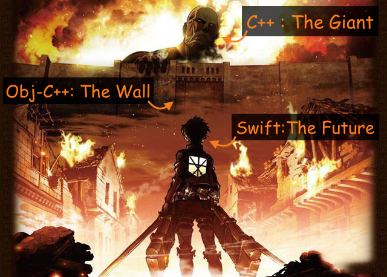

# OpenCV on iOS
## A Simple Demo on Edge Computing

`Edge Computing`, according to the definition from [wiki](https://en.wikipedia.org/wiki/Edge_computing), is "pushing the frontier of computing applications, data, and services away from centralized nodes to the logical extremes of a network".

  
  
  
  
  
  
Seriously, are you speaking ENGLISH?

  
  
  
  
  
  
Maybe a picture explain more than words......(really?)

To be specific and concrete, I'll use OpenCV and construct a neural network which can run on an iphone in this demo project.

I'll show you how to make good use of (a.k.a mess up) `C++`, `Obj-C++` and `Swift` and have them work hand in hand (I lied) in one project.

## Prerequisites

- `pod`: a framework manager for iOS project.
- `XCode`

## Setup

1. Start an empty project. In this case, create an empty `OpenCVDemo` poject and close it.
2. Install `OpenCV` with `pod`.
    - Write a `Podfile` in your project directory.
    - Change working directory to your project directory and run `pod install`.
3. You will see a `<your_project_name>.xcworkspace` in your project directory. Open it with `XCode` and start writing code.

## Motivation

Why do I want to do this at the very first place?

Good question and I have a good answer, too.
.  
.  
.  
.  
.  
.  
.  
.  
.  
.  
.  
.  
.  
.  
.  
**Because I want to run machine learning algorithm and sleep well without FXCKING 500 errors. T_____T**

## How It Works

OK, few things to keep in mind:

- `Obj-C` knows how to read `C++`. (`Obj-C++`, to be specific)
- `Swift` knows how to read `Obj-C`.
- `Swift` knows NOTHING abut `C++`. (Do not show `C++` code to `swiftc`)

Then, our strategy is simple:

**Write a wrapper (delegate) in Obj-C++ which will call the C++ code for Swift**

Well, it sounds like extra workload.

 
 
 
 
 
 
 
 
 
 

**Yes, it is.....**

 
 
 
 
 
 

## Summary

## Big News

- [TensorFlow is now on iOS](http://www.theverge.com/2016/6/8/11885924/google-tensorflow-release-ios-magenta-neural-network)
- [BNNS by Apple](https://developer.apple.com/videos/play/wwdc2016/715/)

## External Material

- [Simple NN (Python implementation)](https://gist.github.com/dboyliao/25946484846aa3724f57)
- [My Talk at CocoaHeadsTaipei (EdgeMe project)](https://github.com/dboyliao/Talks_CocoaHeads/tree/master/EdgeMe)

# Info

We are hiring!

- **Android developer!!**
- iOS developer
- Unity developer
- Backend engineer / R&D

[Contact Us](http://www.spe3d.co)
